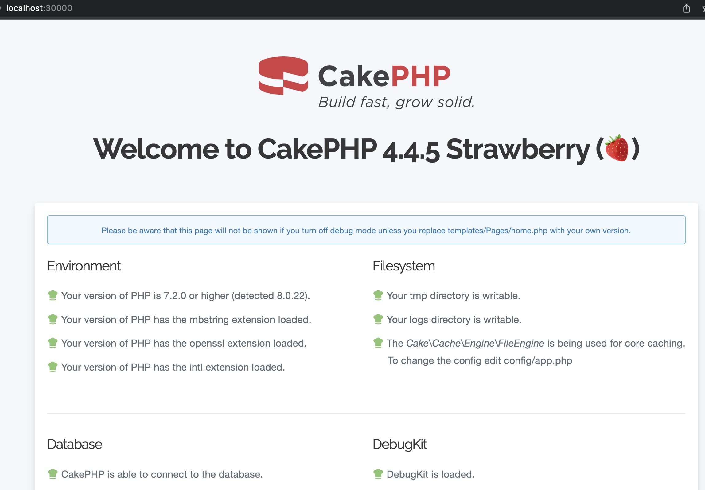

# CakePhp Application on Docker Swarm

*For Demo purpose, we are creating a single node docker swarm*

## Prerequisites

*  The docker client and daemon API must both be at least 1.24 to use this command. Use the docker version command on the client to check your client and daemon API versions.

* You need at least Docker Engine 19.03.0+ for this to work (Compose specification: 3.8).

```bash
docker version
```

## Run the following command to create a new swarm:

```bash
docker swarm init --default-addr-pool 172.18.0.0/24
```

## Create custom Docker network before deploying container (If the network is already created then ignore it)

*Note : Make sure that the subnet won't conflict with any other subnets*

```bash
docker network create --driver=overlay --subnet=172.18.1.0/24 cakephp-network
```

## Deploy a stack to Swarm

```bash
docker stack deploy --compose-file=cakephp-deployment.yml cakephp-stack
```

* the above stack having 2 services

    * Cakephp application server

    * MySQL 8 server


## Working with cakephp deployment

* List the stack

```bash
docker stack ls
```

* List the tasks in the stack

```bash
docker stack ps cakephp-stack
```

* List the services in the stack

```bash
docker stack services cakephp-stack
```

* Restarting cakephp-stack

```bash
docker stack deploy --compose-file=Ldap-swarm.yml cakephp-stack
```

* Removing stack

```bash
docker stack rm cakephp-stack
```

* If you are able to deploy the application on docker swarm successfully, then you will able to see this



## Accessing the services

* Web UI (apache2) : `http://localhost:30000`

* SSH access to the container : `ssh cakeapp-user@localhost -p 30001`

* MySQL can be access only within the swarm network


*All of the above configuration can be changed and can pass the custom user info details as swarm stack environment variables*


**cakephp-server**

Env Name	         |  Default Value   |  Description
---------------------|---------------------|---------------------
SSH_USERNAME	 | `cakeapp-user`	| SSH username
SSH_PASSWORD	 | `SomeSecureSSHPass`	| SSH password
MYSQL_USERNAME	 | `appuser`	| MySQL user
MYSQL_PASSWORD	 | `SomeSecureDBPass`	| MySQL user password
MYSQL_HOST	 | `mysql-server`	| MySQL server
MYSQL_DB	 | `cakephpdb`	| Database name


**mysql-server**

Env Name	         |  Default Value   |  Description
---------------------|---------------------|---------------------
MYSQL_USER	 | `appuser`	| MySQL user
MYSQL_PASSWORD	 | `SomeSecureDBPass`	| MySQL user password
MYSQL_ROOT_PASSWORD	 | `SomeSecureDBRootPass`	| MySQL root password
MYSQL_DATABASE	 | `cakephpdb`	| Database name