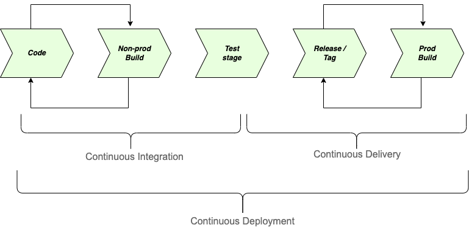

# CakePhp Application on Docker Swarm

# Note

* This demo service is deploying on a single node docker swarm, so its not a cluster solution and port mapping is done with the host option.

* I am adding the health check configuration for both server and MySQL service in the stack which will check the service health and restart the service automatically if there is any issue.

* The docker swarm deployment doesn’t have any volume mount configuration, for production use, we have to mount the data volume for server and MySQL service


# Docker stack

Deployed  the [cakephp](https://cakephp.org) application on docker swarm with the following services. Please find the docker image in my docker registry : [DockerHub](https://hub.docker.com/u/akhilrajmailbox)

* php 8

* nodejs 12

* apache2

* openssh-server

* cakephp 4


# Dev to Prod Life-cycle

When we talk about the automation of app deployment from development to production environment, we have to follow these options.

* CI - Continuous Integration

* CD - Continuous Delivery `or`

* CD - Continuous Deployment



## Continuous Integration

Continuous Integration (CI) is a practice of integrating the daily changes in the code (everything the developer developed) and undergoing some tests and verifying the code to detect if there are any errors in the code before committing to the centralized branches / location.

## Continuous Delivery

Continuous Delivery (CD) is a post practice of CI, where the code will be ready for the deployment but here we have to manually deploy the application to production or any specific environment. This stage will ensure the production ready code at any point of time.

## Continuous Deployment

Continuous Deployment (CD) is different from Continuous Delivery, where the complete process will be automated including the production deployment. Every change in the source code controller will automatically deploy to all non production environments and do the unit test cases or whatever that will conduct under CI, apart from this, the production ready code will also push to the prod environment without any human input.

`Continuous Integration (CI) & Continuous Delivery (CD) is useful in customer facing applications / services where required little downtime or zero downtime.`

`Continuous Deployment (CD) is useful when we need a faster delivery and can manage downtime due to errors.`

* The docker version can be mentioned as the image tag and make the version something meaningful always. If we are using a centralized docker registries, then it's better to follow as below  

    * Example : DEV-M.190.19a5s7d, Where, 

        * DEV : deployment environment name / identifier

        * M : whether this is a manual or auto trigger job (M or A) (if we have manual jenkins job, this will be useful)

        * 190 : Jenkins build number

        * 19a5s7d : short commit sha

    * From the above tag / version, we can easily navigate to all the details of that particular artifact, let's say if we want to debug this deployment code later, we really don’t need any specific tag, this commit sha is fair enough to look into that specific code. But it's always better to have a tag for all production releases.

* The docker images can be stored in the docker private registries and while deploying the service to any environment, on fly the version can be choose from jenkins

* The frontend can be deployed in docker as well, but the best option is always object storage if we are using any cloud provider. This will reduce the load and complex configuration in kubernetes / docker orchestration service deployment

    * AWS - S3
    
    * GCP - Storage Bucket

    * Azure - Blob Storage

* While creating the docker images, its always better to maintain a base image and reduce the number of layers of image, this will help to put more security to the docker images. There may be “N” number of stages before going to production according to the company and services. But these are the main stages that follow in many companies as per my previous experience.

    * Dev

    * Test
    
    * QA
    
    * Demo
    
    * Pre-Prod
    
    * Prod

* All of these above stages can be automated with some CI/ CD tools available in the market, I am choosing Jenkins here as an example, to automate everything, it's better to follow the below conditions,

    * Each environment can have dedicated branches
    
    * Use Jenkinsfile for pipeline jobs
    
    * Use shared library in jenkins (groovy script) which can be reuse in jenkinsfile easily
    
    * Before deploying to production, create tag with proper naming convention
    
    * In dev and test environment, run unit test cases and other sanity test to ensure that all code are stable
    
    * Do frequent scanning with help of some static code scanner such as sonarqube in lower environment


# CD/CI

There can be many automation in the deployment lifecycle for a software, some of them I already mentioned previously, the following will be some of the automation that we can introduce to the development process.

* Version control

    * Store the source code

    * Tools: GitHub, BitBucket, GitLab

* CI and CD

    * Automate the entire integration and deployment.

    * Tools : Jenkins, Drone, Circle CI

* Static code scanning

    * Scanning for vulnerabilities

    * Tools : SonarQube, CodeSonar, Veracode

* Unit test

    * Low level testing related to source code

* Integration test

    * Testing the interaction / communication of different modules of the application

* Functional test (some limitation in automation)

    * Checking the functionality of the feature (like what client expecting)

* Performance testing

    * This test will ensure how the system will behave under a particular workload

* Artifact store

    * Store the artifact in a centralized location

    * Tools : JFrog, Nexus

* Docker Artifact

    * Creating the docker image with artifact of the source code to deploy into any container orchestration tool.

    * Tools: From CI/CD server we can create the docker images, docker cli, DockerHub, Cloud registries : ECR, ACR, GCR

* Container orchestration

    * Managing the docker container

    * Tools: Kubernetes (cloud specific : ECS, EKS, GKE, AKS), Mesos, Docker swarm

* Docker deployment configuration

    * Deployment snippet for docker applications

    * Tools: Helm, yaml file for Kubernetes

    * Compose file  : docker deployment, docker swarm


# Demo : Deployment of the application

*For Demo purpose, we are creating a single node docker swarm*

## Prerequisites

*  The docker client and daemon API must both be at least 1.24 to use this command. Use the docker version command on the client to check your client and daemon API versions.

* You need at least Docker Engine 19.03.0+ for this to work (Compose specification: 3.8).

```bash
docker version
```

## Run the following command to create a new swarm:

```bash
docker swarm init --default-addr-pool 172.18.0.0/24
```

## Create custom Docker network before deploying container (If the network is already created then ignore it)

*Note : Make sure that the subnet won't conflict with any other subnets*

```bash
docker network create --driver=overlay --subnet=172.18.1.0/24 cakephp-network
```

## Deploy a stack to Swarm

```bash
docker stack deploy --compose-file=cakephp-deployment.yml cakephp-stack
```

* the above stack having 2 services

    * Cakephp application server

    * MySQL 8 server


## Working with cakephp deployment

* List the stack

```bash
docker stack ls
```

* List the tasks in the stack

```bash
docker stack ps cakephp-stack
```

* List the services in the stack

```bash
docker stack services cakephp-stack
```

* Restarting cakephp-stack

```bash
docker stack deploy --compose-file=Ldap-swarm.yml cakephp-stack
```

* Removing stack

```bash
docker stack rm cakephp-stack
```

* If you are able to deploy the application on docker swarm successfully, then you will able to see this


## Accessing the services

* Web UI (apache2) : `http://localhost:30000`

* SSH access to the container : `ssh cakeapp-user@localhost -p 30001`

* MySQL can be access only within the swarm network


*All of the above configuration can be changed and can pass the custom user info details as swarm stack environment variables*


**cakephp-server**

Env Name	         |  Default Value   |  Description
---------------------|---------------------|---------------------
SSH_USERNAME	 | `cakeapp-user`	| SSH username
SSH_PASSWORD	 | `SomeSecureSSHPass`	| SSH password
MYSQL_USERNAME	 | `appuser`	| MySQL user
MYSQL_PASSWORD	 | `SomeSecureDBPass`	| MySQL user password
MYSQL_HOST	 | `mysql-server`	| MySQL server
MYSQL_DB	 | `cakephpdb`	| Database name


**mysql-server**

Env Name	         |  Default Value   |  Description
---------------------|---------------------|---------------------
MYSQL_USER	 | `appuser`	| MySQL user
MYSQL_PASSWORD	 | `SomeSecureDBPass`	| MySQL user password
MYSQL_ROOT_PASSWORD	 | `SomeSecureDBRootPass`	| MySQL root password
MYSQL_DATABASE	 | `cakephpdb`	| Database name

